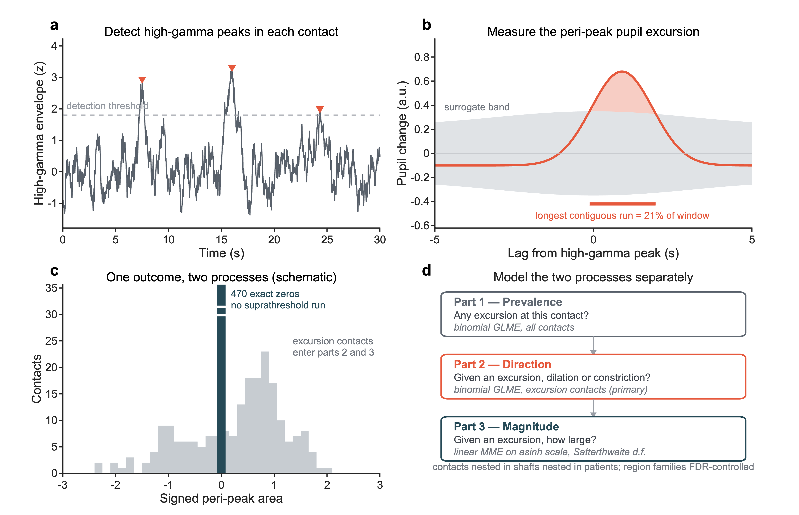

# Methods

Exported verbatim from the submitted manuscript by `tools/build_public_repo.py`. Edit the manuscript builder in the private repository, not this file.

*Figure 1. Measurement and model. (a) High-gamma peaks are detected in each contact. (b) Pupil diameter is averaged around every peak and compared with a surrogate band built from uniformly drawn time points; the stored statistic is the fraction of the window spanned by the longest contiguous run above that band, which is a contiguity criterion and not a p-value. (c) A contact with no suprathreshold run contributes an exact zero, so the outcome is semicontinuous and a single regression on it is misspecified; the distribution shown is schematic and the observed proportions are given in the Results. (d) The two processes are therefore modelled separately, with contacts nested in shafts nested in patients. Traces in (a) and (b) are synthetic illustrations, not data.*

## Materials and methods

### Participants

18 adults undergoing stereo-electroencephalography for the localisation of medically refractory epilepsy were recruited between 2019 and 2021. All participants gave informed written consent under a protocol approved by the University of Utah Institutional Review Board (#00069440). Twelve participants performed a visuospatial working-memory task, three a thermal-perception task, and three were recorded during eyes-open quiet wakefulness. Electrode placement was determined solely on clinical grounds.

### Electrodes, recording and localisation

Clinical stereo-electrodes and subdural arrays (4–10 platinum contacts per shaft; Ad-Tech, Racine, WI, USA, or DIXI Medical, Besançon, France) were localised with LeGUI (Davis et al., 2021), which coregisters the postoperative computed-tomography scan to the preoperative T1 MRI, segments contacts, and assigns each to a Neuromorphometrics parcel in native and MNI space. Across participants, 913 contacts on 146 distinct shafts passed artefact criteria and were distributed over 47 anatomical regions. Field potentials were digitised at 1 kHz on a 128-channel NeuroPort system (Blackrock Microsystems, Salt Lake City, UT, USA) and bandpass-filtered 0.3–250 Hz. Re-referencing is an analysis step and is described below. Pupil diameter was recorded at 250 Hz with a Pupil Core infrared eye-tracker (Pupil Labs, Berlin, Germany) and time-locked to the neurophysiological acquisition. Template surfaces for display were generated with LeGUI's own LeG_genSurfaces routine from the bundled tissue probability maps.

### High-gamma peaks and the peri-peak pupil response

Continuous data were re-referenced to a shaft Laplacian — each contact minus the mean of its immediate neighbours on the same electrode, or the single available neighbour at a shaft end — and notch-filtered at 60, 120, 180 and 240 Hz. High-gamma power was obtained by band-pass filtering at 70–170 Hz with a zero-phase first-order Butterworth filter and taking the squared magnitude of the analytic signal. A separate wavelet decomposition into 71 bands between 2 and 256 Hz was used only for the spectral analyses reported as exploratory. High-gamma power peaks were defined as local maxima exceeding the median plus five interquartile ranges. For each contact we extracted pupil diameter in a ±20 s window around every peak. Each single-peak window was linearly detrended across its full extent, windows whose variability was an outlier were discarded, and the remainder were averaged; the mean response was then centred on its own median. This was repeated over 100 permutations, each resampling up to 1000 observed peak times with replacement, and a surrogate distribution was built in parallel from an equal number of time points drawn uniformly at random from the valid pupil range. The response band is 1.96 times the standard deviation across permutations, and the surrogate level is the root-mean-square of the corresponding surrogate band over the whole window.

Within the central ±5 s of the window we identified time points at which the response confidence band lay entirely outside the root-mean-square of the surrogate standard error, separately in the positive and negative directions, and retained the longest contiguous run of such points. Two quantities were stored: the signed area of that run, and the fraction of the ±5 s window it spanned.

This second quantity requires an explicit statement, because it has been described inaccurately in earlier drafts of this work. It is a contiguity statistic: the proportion of the analysis window covered by the longest suprathreshold run. It is not a permutation p-value, it has no calibrated null distribution, and a threshold applied to it does not control any error rate. Throughout this paper, a contact passing the historical criterion (contiguity > 0.10; n = 177) is therefore called a ‘selected’ contact and is used only descriptively. No confirmatory claim in this paper is conditioned on it.

### Statistical analysis

The stored signed response is exactly zero for every contact on which no suprathreshold excursion occurred — 628 of 913 contacts (69%) in this dataset. The variable is therefore semicontinuous, and a Gaussian model fitted to the pooled variable is misspecified. We used a two-part hurdle decomposition.

Part 1 (prevalence) asked whether a contact showed any excursion, using a binomial generalized linear mixed model with region as a fixed effect and random intercepts for patient and for shaft nested within patient, fitted by Laplace approximation over all contacts. Part 2 (direction), the primary confirmatory analysis, asked whether an excursion was dilation- or constriction-linked, using the same random-effects structure over the contacts that showed an excursion. The prespecified fixed effect was hippocampal versus extrahippocampal. Part 3 (magnitude) modelled the signed response among excursion contacts with a linear mixed model on an inverse-hyperbolic-sine scale, with Satterthwaite denominator degrees of freedom so that inference is not carried out at the contact level.

Contacts are not independent observations: neighbouring contacts on one shaft are millimetres apart and share a reference neighbourhood, and the patient is the biological unit of replication. Both levels therefore carry random intercepts. Families of region contrasts were corrected with the Benjamini–Hochberg procedure and are reported as q values. Two additional checks are reported for the primary result: a within-patient paired comparison using the patient as the unit of analysis, and a sensitivity analysis re-estimating the effect across a range of historical selection thresholds. Analyses were performed in MATLAB R2024b (Statistics and Machine Learning Toolbox); code and derived tables are available as described under Data availability.

### Prespecified replication in an independent cohort

We attempted to replicate the primary result in an independent intracranial cohort with simultaneous pupillometry (Cimbalnik et al., 2022), obtained from EBRAINS under CC BY-NC. The protocol — the hypothesis, the primary contrast, the exclusions and the decision rule — was written and placed under version control before the data were obtained, and is reproduced in the project repository. The confirmatory hypothesis was that hippocampal contacts would again be less likely than extrahippocampal contacts to be dilation-linked, with success defined as an odds ratio below one whose 95% interval excludes one.

Of the ten participants described in the source publication, 5 were available to us; 4 of those had hippocampal coverage. Contacts were eligible if they were flagged good in every analysed run and carried a gray-matter anatomical label, which left 397 contacts, 26 of them hippocampal. The two eye-movement tasks in the battery — smooth pursuit and anti-saccade — were excluded in advance, leaving free recall and paired-associate learning.

The measurement was reproduced rather than reimplemented, from the original analysis code: the same shaft Laplacian, the same 70–170 Hz band, high-gamma peaks as local maxima above median + 5 × IQR, the pupil averaged in a ±20 s window with each trial linearly detrended, a surrogate band from 100 permutations of uniformly drawn times, and the longest contiguous suprathreshold run within ±5 s as the outcome. High-gamma peaks were restricted to inter-trial epochs at least 2 s clear of any task event. One capability the discovery cohort lacked was available here: gaze position and screen coordinates were recorded alongside the pupil, and were projected out of the pupil trace before measurement. The gaze-corrected analysis is the prespecified primary; the uncorrected analysis and two stricter epoch definitions are reported as prespecified sensitivity analyses.

As a secondary hypothesis we tested the mechanism proposed in the Discussion of this paper directly. Hippocampal ripples were detected on the wideband signal, and the fraction occurring while the pupil was constricting was compared with a null built by circularly shifting ripple times within each run. Detection used a band-pass, RMS-envelope and spectral-verification detector with explicit rejection reasons, applied to the shaft Laplacian; the common-reference signal was run as a sensitivity analysis. All replication analyses were run once, after the protocol was fixed, and are reported whatever their outcome.

Figure 2. Analysis pipeline. Each contact yields one signed peri-peak response. The single branch is the one that determines the model: a contact whose longest contiguous run never clears the surrogate band contributes an outcome of exactly zero rather than a small number, so prevalence must be modelled separately from direction and magnitude. Part 1 is fitted to all 913 contacts; parts 2 and 3 are fitted to the 285 with an excursion. All three carry random intercepts for patient and for electrode shaft within patient. This diagram is generated from docs/methods_diagram.md in the project repository, where it is version-controlled as text.
