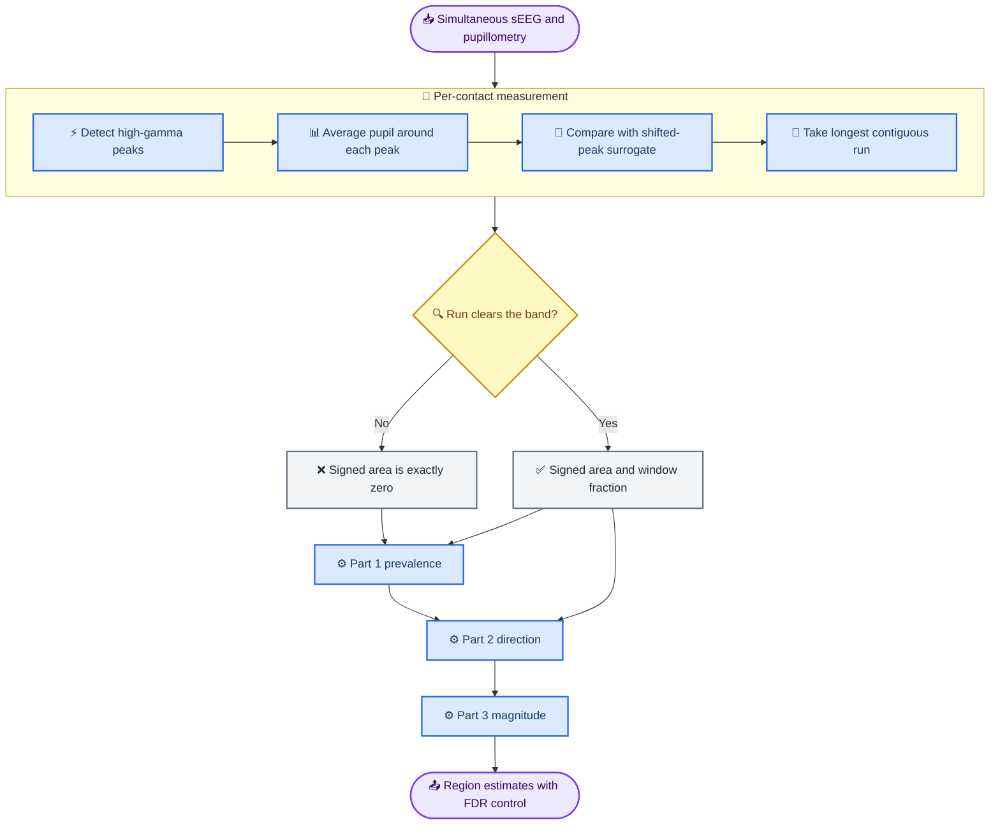

# Analysis pipeline

The diagram below is the canonical description of how a recording becomes a
model estimate. It is the source of the pipeline figure in the manuscript: the
`.md` is what gets edited and version-controlled, and the image embedded in the
paper is rendered from it by `tools/render_mermaid.py`.

## 🔬 From recording to estimate

The single decision in this pipeline is the one that shapes every downstream
choice. A contact on which the peri-peak pupil trace never leaves the surrogate
band contributes an outcome of *exactly* zero rather than a small number, so the
outcome variable carries a point mass that no single regression can absorb. The
flow therefore splits at that decision and rejoins in a hurdle model whose first
part is fitted to every contact and whose second and third parts are fitted only
to contacts that cleared the band.

## 📐 What each part asks

Every model in the hurdle carries the same random-effects structure: contacts
nest within electrode shafts, and shafts nest within patients. Neighbouring
contacts on one shaft sit millimetres apart, and the patient is the unit of
biological replication, so treating contacts as independent would badly
overstate the evidence.

| Part | Fitted to | Question | Model |
| --- | --- | --- | --- |
| 1 Prevalence | all contacts | Does this contact couple at all? | binomial GLME |
| 2 Direction | excursion contacts | Dilation or constriction? | binomial GLME (**primary**) |
| 3 Magnitude | excursion contacts | How large is the response? | linear MME, asinh scale, Satterthwaite d.f. |

## ⚠️ The two properties that force this design

| Property | Consequence |
| --- | --- |
| The stored coupling statistic is a **contiguity criterion**, not a p-value — the fraction of the window spanned by the longest suprathreshold run | Thresholding it *selects* contacts; it does not identify significant ones, and no confirmatory claim may be conditioned on it |
| The signed response is **semicontinuous** — exactly zero wherever no run cleared the band | A Gaussian model on the pooled variable is misspecified; prevalence and direction must be modelled separately |

Both are stated in full in [`METHODS.md`](../METHODS.md) and
[`analysis_plan.md`](analysis_plan.md).
